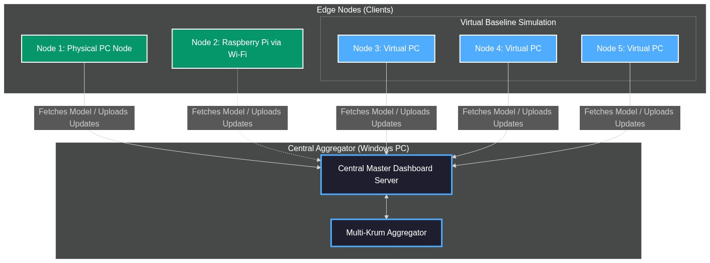
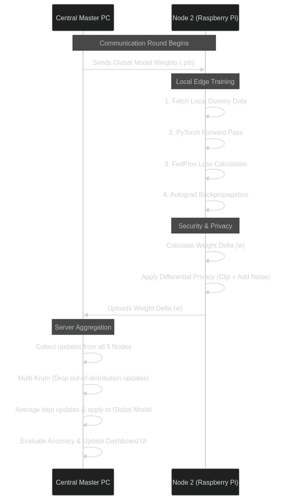
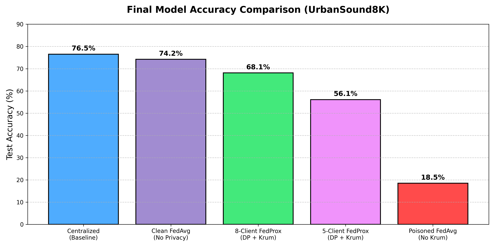
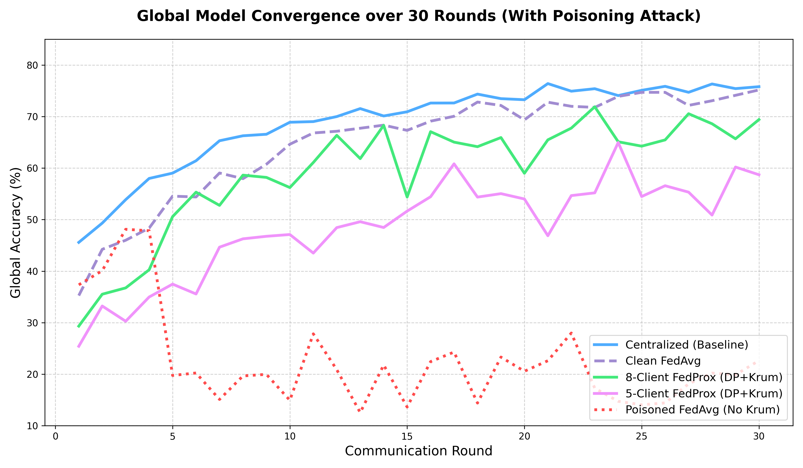
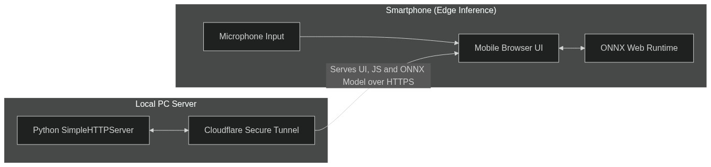

# Privacy-Preserving & Byzantine-Robust Federated Learning for Urban Sound Classification on Edge Devices

<p align="center">
  
  
  
  
  
</p>

## Abstract

Standard Federated Learning (FedAvg) assumes every client is honest and that data is identically distributed — neither assumption holds in real-world edge deployments. A single malicious (Byzantine) client can silently collapse the global model's accuracy from **76%+ to under 12%**, while naturally heterogeneous (Non-IID) audio data causes catastrophic client drift.

This project builds a lightweight **~120K parameter CNN** for urban sound classification on the [UrbanSound8K](https://urbansounddataset.weebly.com/urbansound8k.html) dataset and implements a **Tri-Fold Defense**:

1. **FedProx** — Proximal regularization to correct Non-IID client drift
2. **Multi-Krum** — Byzantine-robust aggregation that detects and drops poisoned updates
3. **Differential Privacy** — L2 norm clipping + Gaussian noise to protect raw client data

The system is validated end-to-end with a **real Raspberry Pi** performing live PyTorch backpropagation over Wi-Fi and a **smartphone web demo** running 100% local ONNX inference with zero data leakage.

---

## System Architecture

<p align="center">
  
</p>

---

## Federated Learning Workflow

<p align="center">
  
</p>

---

## Key Features

- **Lightweight CNN (~120K params)** — 4× Conv2D + BatchNorm + ReLU + MaxPool → Global Average Pooling → Dropout → Linear(128→10)
- **Non-IID Simulation** — Dirichlet distribution (α=0.5) creates realistic, unbalanced data partitions
- **FedProx** — Proximal penalty term prevents client drift under heterogeneous data
- **Multi-Krum** — Byzantine-resilient aggregation that rejects outlier (malicious) updates
- **Differential Privacy** — L2 gradient clipping (S=10.0) + Gaussian noise (σ=0.005)
- **Real Hardware** — Raspberry Pi 4 performs live PyTorch training over Wi-Fi
- **Edge Inference** — ONNX Runtime Web runs predictions 100% locally on smartphone browser
- **Live Dashboard** — Real-time accuracy curves, weight update logs, and Multi-Krum feed

---

## Results

### Accuracy Comparison

| Model | Final Accuracy | Notes |
|---|---|---|
| Centralized (Baseline) | **80.05%** | Upper bound — all data on one machine |
| Clean FedAvg (No Attack) | **76.82%** | Standard FL, no defense needed |
| 8-Client FedProx + DP + Krum | **72.67%** | ✅ Tri-Fold Defense under attack |
| 5-Client FedProx + DP + Krum | **70.85%** | ✅ Tri-Fold Defense under attack |
| Poisoned FedAvg (No Krum) | **11.95%** | ❌ Collapses under Byzantine attack |

<p align="center">
  
</p>

### Learning Curves (With Poisoning Attack)

<p align="center">
  
</p>

---

## Edge Inference (Web Demo)

<p align="center">
  
</p>

The trained model is exported to ONNX format and runs **100% locally** on the user's smartphone browser via ONNX Runtime Web. No audio data is ever sent over the internet.

---

## Project Structure

```
Privacy-Preserving-Federated-Learning/
│
├── README.md
├── .gitignore
├── requirements.txt
├── export_onnx.py                     # PyTorch → ONNX conversion utility
│
├── core/                              # Shared modules
│   ├── config.py                      # Hyperparameters & device config
│   ├── model.py                       # UrbanSoundCNN architecture
│   ├── dataset.py                     # UrbanSound8K data loader
│   └── preprocess.py                  # Audio → Mel-Spectrogram pipeline
│
├── training/                          # Training scripts
│   ├── train_centralized.py           # Centralized baseline
│   ├── train_federated_5clients.py    # 5-client FL with Tri-Fold Defense
│   └── train_federated_8clients.py    # 8-client FL with Tri-Fold Defense
│
├── demo/                              # Live demo components
│   ├── pc/                            # PC Master Dashboard & FL nodes
│   ├── rasp/                          # Raspberry Pi edge training node
│   └── web_demo/                      # Smartphone ONNX inference demo
│
├── models/                            # Saved model weights
│   ├── model_*_robust.pth             # Tri-Fold Defense models
│   ├── model_*_clean_fedavg.pth       # Clean FedAvg baselines
│   ├── model_*_attacked.pth           # Poisoned/attacked models
│   └── *.onnx                         # ONNX models for browser inference
│
├── results/                           # Training results & plots
│   ├── centralized/
│   ├── federated_5clients/
│   └── federated_8clients/
│
├── diagrams/                          # Architecture & result diagrams
│
└── docs/
    └── Project_Explanation_Guide.pdf
```

---

## CNN Architecture

| Layer | Input Shape | Output Shape | Function |
|---|---|---|---|
| Conv2D(1→16) + BN + ReLU + MaxPool | (1, 128, 173) | (16, 64, 86) | Detects basic spectral patterns |
| Conv2D(16→32) + BN + ReLU + MaxPool | (16, 64, 86) | (32, 32, 43) | Detects rhythmic/harmonic patterns |
| Conv2D(32→64) + BN + ReLU + MaxPool | (32, 32, 43) | (64, 16, 21) | Detects high-level acoustic concepts |
| Conv2D(64→128) + BN + ReLU + MaxPool | (64, 16, 21) | (128, 8, 10) | Extracts deepest features |
| Global Average Pooling | (128, 8, 10) | (128) | Compresses to lightweight vector |
| Dropout(0.3) + Linear(128→10) | (128) | (10) | Final 10-class prediction |

**Total Parameters: ~120K** — designed for edge device deployment.

---

## Setup & Installation

### Prerequisites
- Python 3.10+
- [UrbanSound8K Dataset](https://urbansounddataset.weebly.com/urbansound8k.html) (download separately)

### Install Dependencies
```bash
pip install -r requirements.txt
```

---

## How to Run

### 1. Centralized Training (Baseline)
```bash
python training/train_centralized.py
```

### 2. Federated Training (5-Client with Tri-Fold Defense)
```bash
python training/train_federated_5clients.py
```

### 3. Federated Training (8-Client with Tri-Fold Defense)
```bash
python training/train_federated_8clients.py
```

### 4. Live FL Demo (PC + Raspberry Pi)

**Step 1:** Start the PC Master Dashboard:
```bash
python demo/pc/run_pc_review1.py
```

**Step 2:** On the Raspberry Pi (connected to the same Wi-Fi):
```bash
python3 demo/rasp/node2_rasp_physical.py <PC_IP_ADDRESS>
```

### 5. Web Demo (Smartphone Inference)
```bash
python demo/web_demo/host_demo.py
```
Open the generated Cloudflare tunnel URL on your smartphone browser.

### 6. Export Model to ONNX
```bash
python export_onnx.py
```

---

## Technologies Used

| Technology | Purpose |
|---|---|
| Python 3.10 | Core programming language |
| PyTorch 2.x | Deep learning framework for CNN training |
| ONNX | Model export format for cross-platform inference |
| ONNX Runtime Web | Browser-based ML inference engine |
| Flask | PC Master Dashboard server |
| Cloudflare Tunnel | Secure HTTPS tunnel for smartphone demo |
| Raspberry Pi 4 | Physical edge device for FL training |
| JavaScript (Web Audio API) | Audio capture and Mel-spectrogram in browser |

---

## License

This project is licensed under the MIT License.
